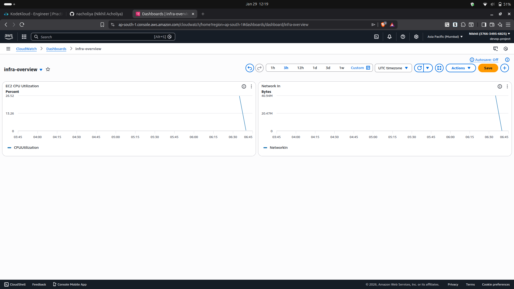

# Day 12 – CloudWatch Dashboards with Terraform

## What This Builds
This module creates a **CloudWatch Dashboard** using Terraform to visualize
key AWS infrastructure metrics such as EC2 CPU utilization and network traffic
in a single centralized monitoring view.

## AWS Services Used
- Amazon CloudWatch
- Amazon EC2

## Resources Created
- CloudWatch Dashboard

## Architecture
EC2 Metrics  
→ CloudWatch Metrics  
→ CloudWatch Dashboard  
→ Centralized Visualization

## Dashboard Preview



## How to Deploy

```bash
terraform init
terraform plan
terraform apply
```

## How to Clean Up

```bash
terraform destroy
```

## Key Learnings

- Difference between CloudWatch metrics, logs, alarms, and Dashboard
- How Dashboard provide real-time visibility into infrastructure health
- Monitoring EC2 CPU utilization and network traffic