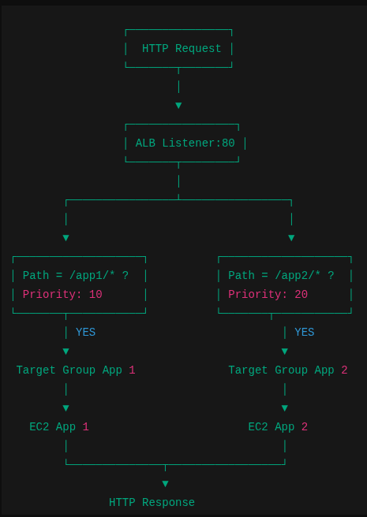

# Day 18 – ALB Advanced Routing with Terraform

## What This Builds
This module configures advanced Application Load Balancer (ALB) routing
using path-based rules to direct traffic to different target groups
based on URL paths.

## AWS Services Used
- Application Load Balancer (ALB)
- Target Groups
- Amazon EC2
- Amazon VPC

## Resources Created
- Application Load Balancer
- Multiple Target Groups
- Listener Rules (Path-Based Routing)
- EC2 Instances

## Architecture



## Traffic Flow Explanation
HTTP Request  
→ ALB Listener (Port 80)  
→ Rule 1: `/app1/*` (Priority 10) → Target Group App 1 → EC2 App 1  
→ Rule 2: `/app2/*` (Priority 20) → Target Group App 2 → EC2 App 2  
→ HTTP Response

## How to Deploy

```bash
terraform init
terraform plan
terraform apply
```

## How to Verify

- Access : ```http://<ALB-DNS>/app1/```
- Access : ```http://<ALB-DNS>/app2/```
- Confirm traffic routes to correct EC2 instance

## How to Clen Up

```bash
terraforn destroy
```

## Key Learnings

- Path basde routing
- Managing multiple application behind a single ALB
- How ALB listener rules work